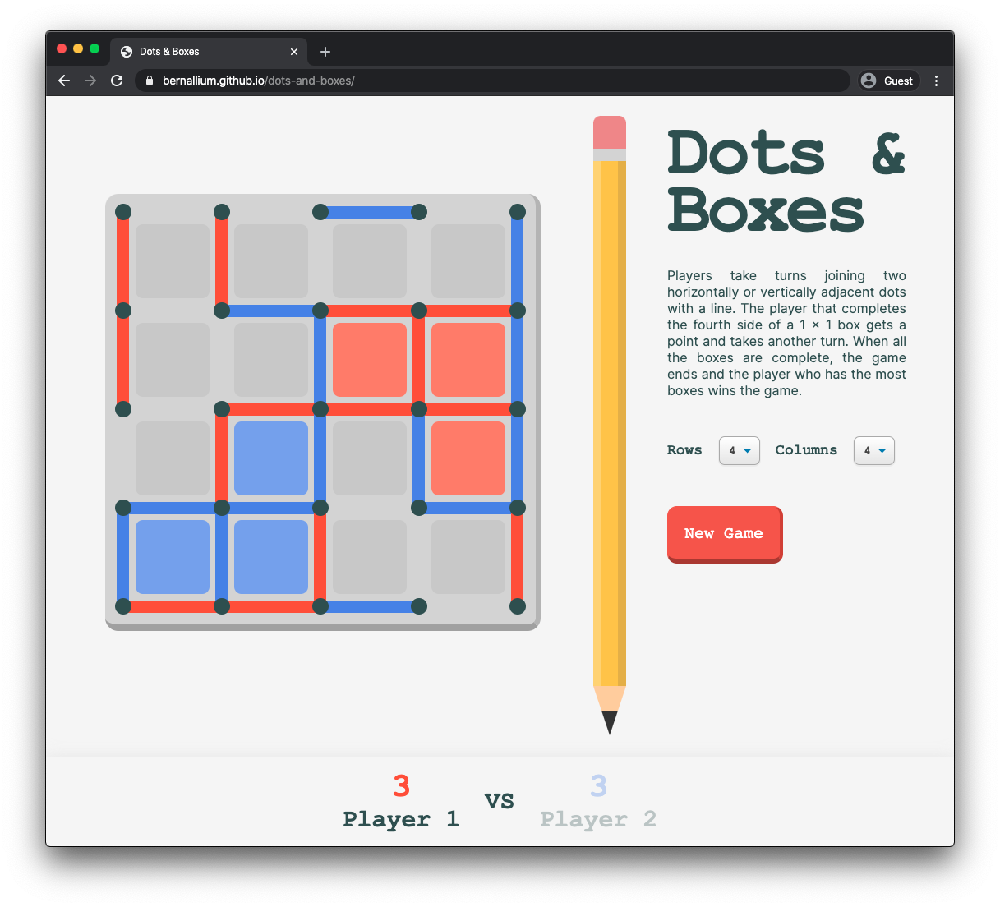
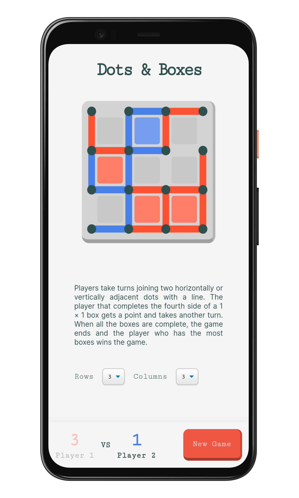

# Dots & Boxes

**Dots & Boxes** is a two-player turn-based strategy game. Games are played on a board containing a grid of dots. Players take turns joining two horizontally or vertically adjacent dots with a line. The player that completes the fourth side of a 1 × 1 box gets a point and takes another turn. When all the boxes are complete, the game ends and the player who has the most boxes wins the game. Players can change the game board size to fit their needs, however, a 4x4 board size is recommended for beginners.

### [Click here to play!](https://bernallium.github.io/dots-and-boxes/)

  

Short demo of a typical game

  

Players can play on different board sizes (HTML elements are created at runtime)

  

Responsive design for different device sizes. Try it on mobile!

### Why did I create this game?
I wanted to create a simple game where the layout's DOM elements are generated dynamically using JavaScript, to allow for various board game sizes without. This constraint forced me to think about the necessary data structures to iterate over, so that the game logic and layout were cohesive. The result was a very minimal HTML file and dynamic board sizes based on user entered row and column numbers. Also, I wanted to implement various aspects of responsive design so that the game could be played on smaller devices.  

## Built With 👨‍💻

* `Javascript`
* `HTML`
* `CSS`

## Next Steps

* Add a *quick-start* mode where game will start with a pre-filled board
* Add a computer player that users can play against
* Refactor to leverage the React.js library
