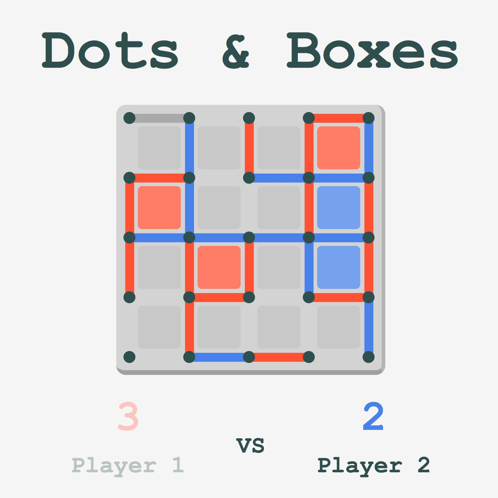

# Dots & Boxes

## Summary

A two player game where players take turns joining two horizontally or vertically adjacent dots with a line. The player that completes the fourth side of a box gets a point and takes another turn. When all the boxes are complete, the game ends and the player who has the most boxes wins the game.

[Click here to play!](https://bernallium.github.io/dots-and-boxes/)

## Technologies
* Javascript
* HTML
* CSS

## Next Steps

* Optimize for mobile
* Add a 'quick-start' mode where the game will start with a pre-filled board
* Add a computer player that users can play against
* Add a timer function to encourage players to make decisions quickly
